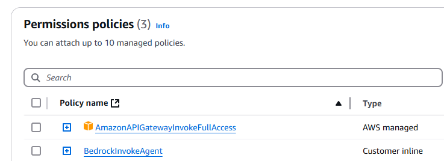
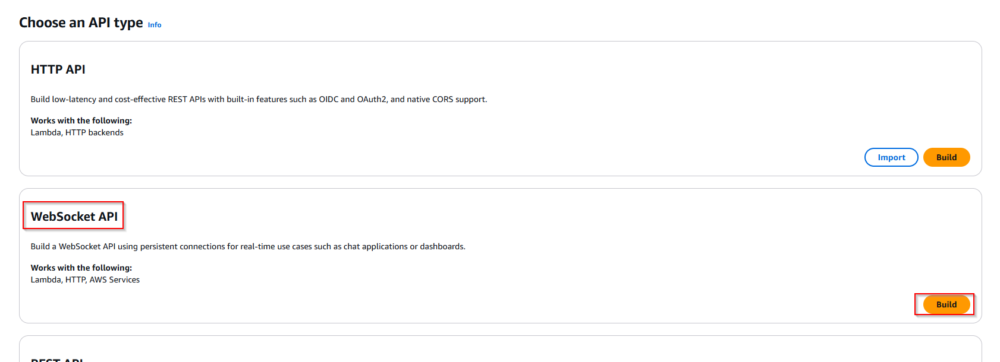
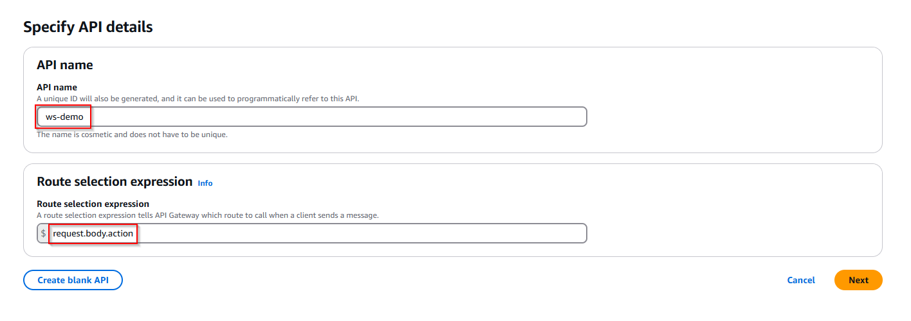
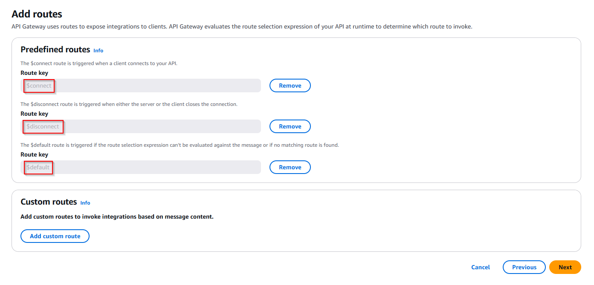
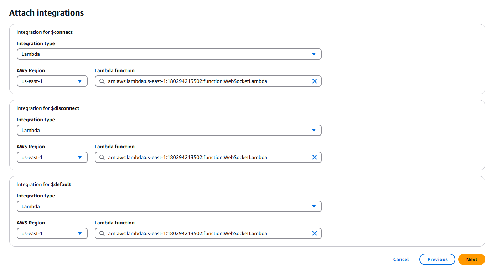

# Fix API Gateway Timeout Errors with Bedrock Agent Invocations

Ever since GenAI took over the tech landscape, everyone is trying to jump onto the bandwagon - some aimlessly while others trying to squeeze out the maximum potential for operational efficiency and cost savings. Amazon Web Services (AWS) is arguably the top cloud services provider in the world right now, and it seems like they've also got a pretty good grip on providing GenAI services to their customers, mostly via a service called Amazon Bedrock.

Amazon Bedrock allows customers to pick from a wide range of foundational LLMs, tailoring them to their own use-cases using fine-tuning, continual pre-training, retrieval augmented generation (RAG) and agents, while also providing essential helper features like guardrails to filter out harmful requests and responses. Talking about Amazon Bedrock doesn't only unlock a chapter in a book, it is the whole book. So, for the sake of this blog, let's briefly go over agents. What are they?

Everyone has been having their fair share of fun with generative AI-powered chatbots, and they're a positive addition to the consumer market. However, limiting ourselves to using LLMs for basic Q&A tasks is equivalent to buying a Bugatti Chiron and driving it at 80 km/h on the German Autobahn.

LLMs come with a not-so-hidden gem - reasoning capabilities. While these capabilities do stem from the vast knowledge they have about virtually everything one can imagine, it is that same knowledge that allows them to reason well. These reasoning capabilities open new doors for probably every industry that uses technology. We can open these doors by automating repetitive tasks using these capabilities.

Talking about the technicalities of how LLMs can be used as agents to automate workflows is a topic for another blog. For now, just know that Amazon Bedrock provides a feature called "Agents for Amazon Bedrock", which takes away most of the technicalities from you and allows you to focus on the automation part.

When we ask ChatGPT a question, it responds almost instantaneously. Right? This is because ChatGPT is matching your query to the best possible answers and displaying them to you and that is the simplest use-case for LLMs. However, when it comes to agents, there's a lot more going on. An LLM is being called multiple times, with dynamic knowledge from possibly multiple sources. This results in delayed responses, sometimes taking up to 2 minutes.

In a usual request-response scenario, we'd invoke an LLM using an AWS Lambda function with proxy integration with Amazon API Gateway.


This way, we'd be able to make an HTTP request to an endpoint and receive a response, and it'd be quite the cost-effective solution. However, the problem with this architecture is the `29s` timeout in Amazon API Gateway. When invoking agents, this timeout is often hit, resulting in a bad user experience and loss of data. If you want Amazon Bedrock and AWS Lambda to be a constant in a similar scenario, web sockets are the answer. 

As opposed to simple HTTP requests, web sockets allow full-duplex connections between a server and clients. This allows asynchronous communication and eliminates the need to tackle request timeouts. Using web sockets usually requires a server being set up to allow connections over the web socket protocol. However, Amazon API Gateway takes all your troubles away by allowing native web socket integration with AWS Lambda. This means you get to reap
the benefits of serverless asynchronous communication between users and agents. Let's get to how we can achieve this.

## Set Up
### Step 1 - Creating the Lambda Function
First, we need a Lambda function that is triggered by a web socket command and invokes a Bedrock agent. For that, we can use the following code snippet:

```python
def lambda_handler(event, context):
    try:
        request_context = event.get("requestContext", {})
        command = request_context.get("routeKey")

        if command in ["$connect", "$disconnect"]:
            return {"statusCode": 200}

        elif command == "$default":
            connection_id = request_context.get("connectionId")
            body = event.get("body")
            parsed_body = json.loads(body)
            email = parsed_body.get("email")
            prompt = parsed_body.get("prompt")

            res = invoke_agent(email=email, prompt=prompt)

            domain_name = request_context.get("domainName")
            stage = request_context.get("stage")

            client = boto3.client('apigatewaymanagementapi', endpoint_url=f"https://{domain_name}/{stage}")
            client.post_to_connection(ConnectionId=connection_id, Data=json.dumps(res))

            return {"statusCode": 200}
    except Exception as e:
        logging.error(e)
        return {"statusCode": 500}
```
> The `invoke_agent` function is a self-written function that invokes the Bedrock agent using `boto3`.

This lambda function receives an event dictionary according to the specification defined in [Set up a WebSocket API integration request in API Gateway](https://docs.aws.amazon.com/apigateway/latest/developerguide/apigateway-websocket-api-integration-requests.html) and handles web socket connections, using the `$default` command as a trigger for agent invocation.

That's not it for the Lambda function. We need to assign permissions for:
* API Gateway management
* Bedrock agent invocation

The Lambda execution role should look something like this:



The `AmazonAPIGatewayInvokeFullAccess` policy is an AWS-managed policy that allows management and invocation of the API Gateway service. `BedrockInvokeAgent` is a policy I created to allow the Lambda function to invoke our Bedrock agent, and it looks like this:

```json
{
	"Version": "2012-10-17",
	"Statement": [
		{
			"Action": "bedrock:InvokeAgent",
			"Resource": "arn:aws:bedrock:us-east-1:<ACCOUNT ID>:agent-alias/<AGENT ID>/*",
			"Effect": "Allow"
		}
	]
}
```

With these permissions being set, our Lambda function is ready for invocation.

### Step 2 - Setting up a Web Socket API using Amazon API Gateway

Now, we need to create an API that allows web socket connections via Amazon API Gateway. To do this, we can go to the AWS Management Console, navigate to the Amazon API Gateway service console and click on `Create API`. Now, we can select the `Websocket API` option from the list and click on `Build`.



Then, we can give our API a name and use the default action.



Next up, we need to add all 3 pre-defined routes to our API (`$connect`, `$disconnect` and `$default`).



Then, we need to assign our previously created Lambda function as an integration for all three routes.



Finally, we can create a stage for our API and finalize the creation.

## Testing
Once we're done with the setup, we can navigate to the `Stages` section of our newly created API and copy the websocket URL.


We can use the `wscat` tool to test our API out.


Now we know that our setup works, and we can go ahead and integrate this with our frontend to allow our users to communicate with the agent, without facing any timeout errors!

<hr/>

Since we're at the end of our blog, I'd like to give everyone a reminder that ***"where there's a will, there's a way"***. I hope this helps anyone who has been facing the same issue as me. [Here's](./template.yaml) a starter CloudFormation template you can use to get this setup running in just a single click. Just pass the agent ID, agent alias ID, memory ID and ARN as parameters, and you're good to go!